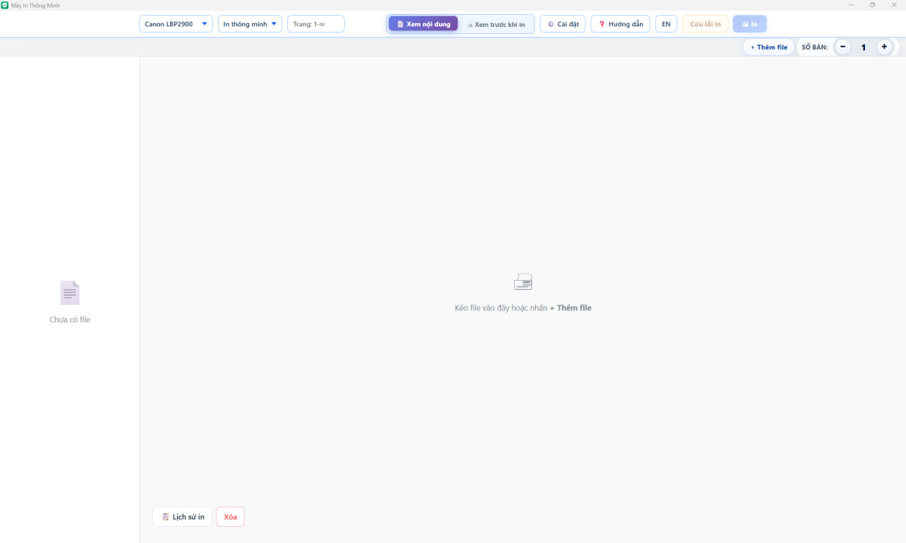
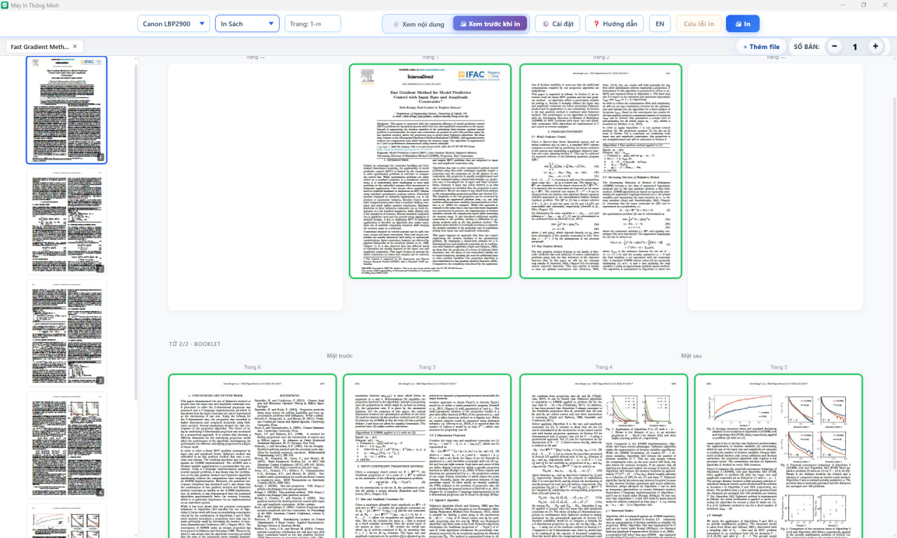
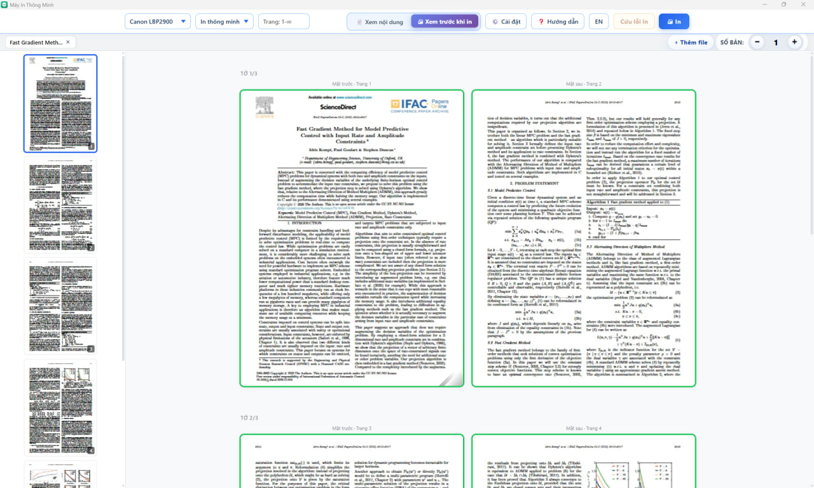

# Smart Printer

Smart Printer is a Windows desktop application for practical, reliable document printing. It combines a WinForms host, a local ASP.NET Core backend, and a WebView2 interface to make duplex printing, booklet layout, page selection, and manual paper handling easier to control.

The community build does not require an account, product key, activation server, or machine registration. Printing is handled locally through the installed Windows printer and document tools.

[**Download Smart Printer v1.0.3 → Releases**](https://github.com/ndak79/myPrinter/releases/tag/v1.0.3)

The Windows installer on the release page contains a self-contained `win-x64` desktop build, so end users do not need to install the .NET SDK.

## Highlights

- Detects installed Windows printers and reports availability and duplex capability.
- Prints PDF, Word, and common image files through one workflow.
- Supports `.pdf`, `.doc`, `.docx`, `.jpg`, `.jpeg`, `.png`, `.tif`, `.tiff`, `.bmp`, and `.webp` uploads.
- Converts Word documents and images to PDF before printing.
- Smart Print mode uses printer duplex when available and falls back to a guided two-pass manual duplex workflow when necessary.
- Booklet mode arranges pages for folding A4 sheets into an A5 booklet, including padding and correct page order.
- Provides page range selection, page deselection, per-page one-sided/two-sided control, page rotation, blank-page insertion/removal, copies, and collation.
- Offers both Page View and physical Print Preview, with zoom and landscape-page handling.
- Keeps each file's page selection, copies, rotations, and layout settings independent when multiple files are open.
- Includes print history, printer settings access, Vietnamese/English localization, a system tray, and optional Windows auto-start.
- Provides visual paper-flip guidance and recovery flows for jammed, missing, or damaged sheets during manual duplex printing.

## Screenshots



*Empty print queue before adding a document.*



*Print Preview showing a booklet layout.*



*Print Preview showing a two-sided print layout.*

## Requirements for users

- Windows 10 or Windows 11.
- Microsoft Edge WebView2 Runtime.
- A Windows printer with its driver installed. The desktop host requests administrator privileges because printer and WMI access are part of the current runtime.
- Microsoft Word desktop for converting `.doc` and `.docx` files.
- The downloaded installer is self-contained for `win-x64`; the .NET SDK is not required to run the installed application.

## Development requirements

- [.NET 10 SDK](https://dotnet.microsoft.com/download/dotnet/10.0).
- Node.js, optional and used to run the frontend test files.
- Inno Setup 6, only when building the Windows installer.

## Build from source

To run the application from source, use the following commands from the repository root:

```powershell
dotnet restore MyPrinter.slnx
dotnet build MyPrinter.slnx
dotnet run --project desktop/MyPrinter.Desktop.csproj
```

The desktop host starts the local backend automatically on an available loopback port, opens the WebView2 application, and places the app in the system tray when hidden startup is requested.

To run the backend by itself:

```powershell
dotnet run --project backend/PrinterApp.csproj
```

The standalone backend listens on the URL configured by its launch settings or command-line arguments. The desktop host passes its own local URL when it starts the embedded backend.

## Tests

Run the .NET test suites:

```powershell
dotnet test backend.Tests/backend.Tests.csproj
dotnet test desktop.Tests/desktop.Tests.csproj
```

Run the frontend tests with Node.js:

```powershell
$tests = Get-ChildItem frontend/tests -Filter *.test.mjs -File |
    Select-Object -ExpandProperty FullName
node --test $tests
```

## Build the installer

With the development requirements installed, run:

```powershell
.\build-installer.ps1 -Version 1.0.0
```

The script runs the backend and desktop tests, publishes a self-contained `win-x64` desktop build, checks the frontend payload for development-only files, and compiles `installer/myPrinter.iss`. Use `-SkipTests` only when you deliberately want to skip the script's test stage.

## Printing workflow

1. Select a printer from the top bar. The printer list shows status and duplex capability.
2. Add one or more files by dragging them into the app or using **+ Add File**.
3. Select a print mode and, when needed, enter a page range such as `1-5`, `1,3,7`, or `2-8,12`.
4. Inspect the document in **Page View** or switch to **Print Preview** to see physical sheets.
5. Adjust pages, rotations, one-sided pages, blank pages, copies, collation, or landscape handling from the preview controls.
6. Press **Print** and follow the on-screen status and paper instructions.

### Smart Print and manual duplex

For a printer with automatic duplex, Smart Print delegates two-sided output to the printer where appropriate. For a single-sided printer, the app prints the front pass first, pauses, and shows an animated flip guide. Keep the stack in order, flip it exactly as shown, place it back in the tray, and choose **Continue printing** to send the back pass.

Portrait pages normally flip along the long edge. Landscape pages use the short edge when the layout requires it. Always follow the direction shown for the current job and printer tray.

### Booklet mode

Booklet mode creates a two-up A4 layout for an A5 booklet. Pages are padded to a multiple of four and reordered so that folding the printed sheets produces normal reading order. For example, an eight-page booklet begins with the outer sheet ordered as `[8, 1]` on the front and `[2, 7]` on the back.

### Recovery

If a manual-duplex job has a jammed, missing, or damaged sheet, use **Fix print issue** while the recovery state is available. The recovery flow lets you identify affected physical sheets, reprint replacement fronts, follow a second flip instruction, and print replacement backs without discarding the rest of the job.

## Application controls

- **Page View**: inspect individual source pages.
- **Print Preview**: inspect the physical sheet layout before printing.
- **Page context menu**: exclude a page, change its print sides, rotate it, or insert a blank page.
- **Landscape handling**: keep landscape pages together with portrait pages or place them on separate sheets.
- **Files and tabs**: work with multiple files while preserving per-file settings.
- **Print History**: review completed jobs and reprint when supported by the current session state.
- **System tray**: hide/show the main window, start with Windows, or exit the app.
- **Language toggle**: switch between Vietnamese and English UI text.

## Local API

The backend is a local API used by the WebView2 frontend.

| Method | Endpoint | Purpose |
| --- | --- | --- |
| `GET` | `/api/printers` | List installed printers and capabilities. |
| `POST` | `/api/upload` | Upload a supported source file. |
| `GET` | `/api/file/{fileId}` | Serve the current PDF for preview. |
| `POST` | `/api/convert` | Convert a Word or image upload to PDF. |
| `POST` | `/api/print` | Create and execute a print job. |
| `GET` | `/api/print/recovery-context` | List recoverable print jobs. |
| `POST` | `/api/print/continue` | Continue a waiting manual-duplex job. |
| `POST` | `/api/print/recover/back/start` | Start back-pass recovery for selected sheets. |
| `POST` | `/api/print/recover/back/continue` | Continue the replacement back pass. |
| `POST` | `/api/print/recover/front` | Reprint replacement front sheets. |
| `POST` | `/api/print/complete` | Mark a recovered or waiting job complete. |
| `DELETE` | `/api/print/cancel` | Cancel and clean up a job. |
| `POST` | `/api/printer/settings` | Open Windows printer properties. |

The upload limit is 100 MB. The API is designed for the local desktop host and is not configured as a public internet service.

## Project structure

```text
myPrinter/
├─ backend/                 # ASP.NET Core local API and printing services
│  ├─ BackendStartup.cs     # Service registration and API endpoints
│  ├─ Models/               # Print requests, jobs, recovery state, and plans
│  └─ Services/             # Printer discovery, conversion, and print algorithms
├─ desktop/                 # WinForms host and WebView2 shell
│  ├─ Program.cs            # Desktop entry point and backend lifecycle
│  ├─ MainForm.cs           # Tray/window host and frontend bridge
│  └─ WindowsStartupService.cs
├─ frontend/                # Vanilla JavaScript, HTML, CSS, and PDF.js UI
├─ backend.Tests/            # Backend and print-algorithm tests
├─ desktop.Tests/            # Desktop host and startup tests
├─ frontend/tests/           # Node.js frontend behavior tests
├─ installer/                # Inno Setup definition
└─ build-installer.ps1       # Test, publish, and installer pipeline
```

## Troubleshooting

### No printer appears

Confirm the printer is installed in Windows, powered on, and visible to the current administrator session. Reopen the app after installing or changing a driver.

### Word conversion fails

Install Microsoft Word desktop and make sure it can open the source document normally. Word conversion uses Office Interop and therefore requires a Windows Word installation.

### The app window does not open

Smart Printer runs as a single desktop instance. When Windows auto-start is enabled, it may already be running in the notification area with its main window hidden. Opening the Smart Printer shortcut activates that existing instance. If an older build is still running after an upgrade, exit it from the notification area or Task Manager once, then start the new version.

### The app window is blank or does not render

Install or repair the Microsoft Edge WebView2 Runtime, then start Smart Printer again.

### `Undefined` appears when printing

If Smart Printer shows `Undefined` after you click **Print**, download and install [Sumatra PDF](https://www.sumatrapdfreader.org/download-free-pdf-viewer), restart the app, and try printing again.

### Manual duplex output is misaligned

Do not shuffle the stack. Wait until the front pass has fully finished, follow the displayed flip direction, and test one or two sheets before printing a large job. Printer tray geometry differs between models.

## Contributing

Pull requests and issue reports are welcome. Before submitting a change:

1. Keep behavior changes covered by the closest backend, desktop, or frontend test.
2. Run the relevant .NET and Node.js tests locally.
3. Keep generated `bin`, `obj`, `publish`, and `dist` output out of commits.
4. Describe any Windows, Word, printer-driver, or WebView2 prerequisites needed to reproduce the change.

## License

Smart Printer is available under the [MIT License](LICENSE).
